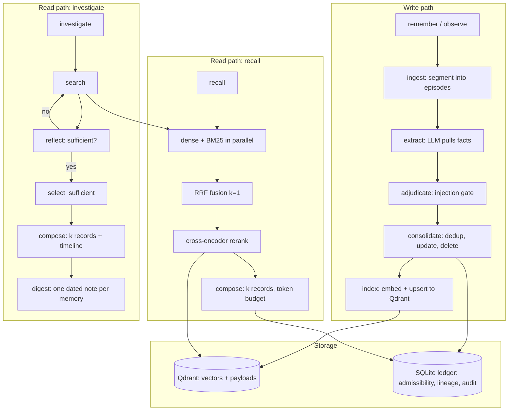

# myelin

Agentic long-term memory for LLM agents, backed by Qdrant. myelin gives an
agent a persistent, multi-tenant memory store with hybrid retrieval (dense +
BM25 + graph), cross-encoder reranking, and an agentic search→reflect loop —
all exposed through a 10-tool MCP surface.

**What it is:** a memory backend that an MCP-compatible agent (Claude, Codex,
any MCP client) can call to `remember` facts, `recall` them, and `investigate`
questions with an agentic loop. It is not a chatbot, not a vector database, and
not a RAG framework — it is the memory layer between an agent and its past.

**Why it exists:** agents that converse over long horizons need to persist what
they learned, retrieve it efficiently, and forget what is wrong. myelin
implements the full write path (extract → consolidate → adjudicate → index)
and two read paths (fast `recall`, agentic `investigate`) described in
[`PLAN.md`](PLAN.md).

## Quickstart

See [`docs/QUICKSTART.md`](docs/QUICKSTART.md) for a step-by-step guide with
every command executed and verified. Summary:

1. Build the workspace: `cargo build --release --workspace`
2. Start three services: Qdrant, an embedder, and a reranker
3. Point myelin at them with `MYELIN_*` env vars
4. Start the MCP server: `myelin-mcp --serve 127.0.0.1:7446 --collection <name> --ledger <path>`
5. Call `remember`, then `recall`

## Features

See [`docs/FEATURES.md`](docs/FEATURES.md) for the full feature reference:
- All 10 MCP tools with parameters, return shapes, and real examples
- Retrieval architecture (three channels, RRF, cross-encoder rerank, compose)
- Write path (dedup, consolidation, injection adjudication, quarantine)
- Multi-tenancy and the scope-before-ranking invariant
- Configuration: every `MYELIN_*` env var with its default
- The `myelin-eval` harness surface

## Architecture




*Figure 1: Qdrant web dashboard at `http://192.168.1.110:6333/dashboard` showing the real `myelin_locomo`, `myelin_longmemeval_s`, and `myelin_lme_v2_small` collections with their vector counts.*

## Configuration

Configuration layers: serialized defaults → `~/.myelin/config.yml` →
`MYELIN_`-prefixed environment variables, with `__` marking nesting
(`MYELIN_QDRANT__URL`, `MYELIN_QDRANT__COLLECTION`).

See [`docs/FEATURES.md`](docs/FEATURES.md#configuration) for the full env-var
table with defaults read from the code.

> **Note:** the hardcoded defaults point at the author's LAN
> (`192.168.1.110`). You will need to override them for your environment. See
> the quickstart for the generic forms.

## Building & testing

Three-crate workspace: `myelin-core` (backend library), `myelin-mcp` (MCP
surface), `myelin-eval` (evaluation harness). Build plan in
[`PLAN.md`](PLAN.md).

```
cargo build --release --workspace                    # build all three crates
cargo test --workspace                               # hermetic, no network
cargo test -p myelin-core --features integration     # requires Qdrant on big
MYELIN_QDRANT__URL=http://192.168.1.110:6334 cargo test -p myelin-core --features integration
```

The `integration` feature enables `crates/myelin-core/tests/qdrant_capability.rs`,
which asserts the four Qdrant 1.19.1 findings the storage design rests on —
three retrieval channels in one collection, server-side RRF at **k = 1** (not
Cormack's 60), gRPC-only multivector rerank, and the BM25 IDF scoring identity.
Measured in
[`docs/research/00-verified-environment.md`](docs/research/00-verified-environment.md)
§3. Each test creates and deletes its own `myelin_test_<fn>_<uuid>` scratch
collection and never touches an existing one; a failing assertion leaves its
scratch collection behind for inspection.

Release binaries are built to the shared target directory:

```
~/.cargo-target-shared/global/release/myelin-mcp
~/.cargo-target-shared/global/release/myelin-eval
```

## Evaluation

The `myelin-eval` harness is a **research tool**, not a product surface. It
scores myelin against the LoCoMo and LongMemEval-S benchmarks with deterministic
scorers and an LLM judge. See [`docs/EVALUATION.md`](docs/EVALUATION.md) and
[`docs/FEATURES.md`](docs/FEATURES.md#myelin-eval-harness) for the subcommand
surface.

Current standing against published systems (regenerated by `myelin-eval
standing`; the full table with comparability verdicts is
[`runs/standing/standing.md`](runs/standing/standing.md), the history is
[`BACKLOG_DONE.md`](BACKLOG_DONE.md#sota-standing)):

| gate | ours | best comparable | gap | since |
|---|---|---|---|---|
| `minja.asr.k6_prepopulated_defended` | **7.50%** | ≤10% | **CLOSED** | M15 |
| `locomo.judge_score_matched.n1540` | **78.18** | 77.85 MemPro-15 (Qwen), same judge | **+0.33** § | M68/M68b |
| `longmemeval_s.judge_score_matched.n500` | 78.60 | 80.80 MemPro-15 (Qwen), LongMemEval's own judge | −2.20 | M70 |
| `locomo.judge_score.n1540` (strict 9B judge) | 70.52 | 77.85 MemPro-15 (Qwen) | −7.33 ‡ | M63 base |
| `longmemeval_s.judge_score.n500` | 79.20 | 80.80 MemPro-15 (Qwen) | −1.60 ‡ | M57 (corrected) |
| `lme_v2_small.overall_full_set.combined` | 38.80 | 58.60 AgentRunbook-R | −19.80 | M47 base |

Every literature row is judged by a frontier API where we are judged by a
local Qwen3.5-9B (`caveat-judge`).
§ **LoCoMo, graded the way the row we chase was graded
([M68](docs/measurements/m68-matched-judge.md)):** MemPro's 77.85 came from
gpt-4o-mini with LightMem's lenient prompt. The same grader, byte for byte,
gives our answers **78.18**. MemPro's own repo judge gives 80.26. The gate
takes the lower reading (the every-reading rule), so it is a `comparable` row
and a closed gate. The lead is
only a hair: re-judging moves it by 2 rows, and a reader change moves 88. The
strict 9B judge (70.52) stays the headline and still decides every arm, and
under both graders we trail MemPro on multi-hop and open-domain. The LME-V2 row is measured at today's
shipped point (undated, digest on, rebuilt store); [M52](docs/measurements/m52-lme-v2-reader-thinks.md)
showed thinking does not close that gap and [M53](docs/measurements/m53-state-completion.md)
located it in retrieval. LoCoMo has resisted two arms: the LongMemEval_S
settings ([M51](docs/measurements/m51-locomo-at-the-shipped-point.md), −4.81) and the events calendar
([M50b](docs/measurements/m50b-locomo-events.md), −0.13, events crowding turns out of k = 6).
[M55](docs/measurements/m55-bonsai-27b-model.md) swapped in Bonsai 27B: LongMemEval_S rose
to 82.20, but the abstention veto fired, and LoCoMo fell 3.18 as the model declined twice as often.
**[M57](docs/measurements/m57-decline-first.md) fixed the veto with one reader clause.**
When a question assumes something the memories don't support, the reader says
"I don't know." first and gives the correction after. LongMemEval_S reached **79.20**:
+4.20 [+1.20, +7.40] over the 9B, with abstention at 29/30. It ships for LongMemEval_S.
‡ **Correction (2026-09-25).** We first reported 83.40 and said it passed MemPro-15
(80.80). A judge defect had counted seeded "correct" verdicts on answers M57 had
replaced with "I don't know."
([defect record](docs/measurements/defect-2026-09-25-stale-verdicts.md)). The
corrected 79.20 is 1.60 **behind** that row. LongMemEval's own grader agrees: 78.60
([M70](docs/measurements/m70-lme-official-judge.md)). The gate is open.
On LME-V2, [M54](docs/measurements/m54-local-file-controller.md)'s local file-reading controller
piloted at **82.98 against 42.55** on 47 questions. The full 451-question pair is running, and
until it lands the 38.80 row stands.
Two gates close on `comparable` rows: MINJA's attack rate, and LoCoMo under
MemPro's own judge (M68, by +0.33).


*Figure 2: `myelin-eval standing` output — 30 rows comparing myelin against published systems (MemPro, Mem0, Zep, NEMORI, etc.) with per-row comparability verdicts.*


*Figure 3: `myelin-eval ratchet` output — regression check against our own pinned floor. All 8 metrics held, 0 regressed.*

```
myelin-eval standing    # 30 rows, comparability verdicts per row
myelin-eval ratchet     # regression check against our own pinned floor
```

## Research vocabulary

The field's vocabulary — memory types, retrieval operations, context
engineering terms, and the 63-paper corpus survey — has been moved to
[`docs/research/00-vocabulary.md`](docs/research/00-vocabulary.md). It is
valuable for understanding the design space; it is not a front page.

## License

See [`LICENSE`](LICENSE).

## Documentation index

| Document | Contents |
|----------|----------|
| [Quickstart](docs/QUICKSTART.md) | Prerequisites, service setup, first remember/recall, MCP client config |
| [Features](docs/FEATURES.md) | All 10 MCP tools, retrieval architecture, write path, config table |
| [Documentation rubric](docs/DOCUMENTATION-RUBRIC.md) | Scored checklist from the documentation-quality literature |
| [Evaluation](docs/EVALUATION.md) | Benchmark methodology and results |
| [Research notes](docs/research/) | Vocabulary, systems survey, SOTA analysis |
| [Build plan](PLAN.md) | Milestone-by-milestone design document |