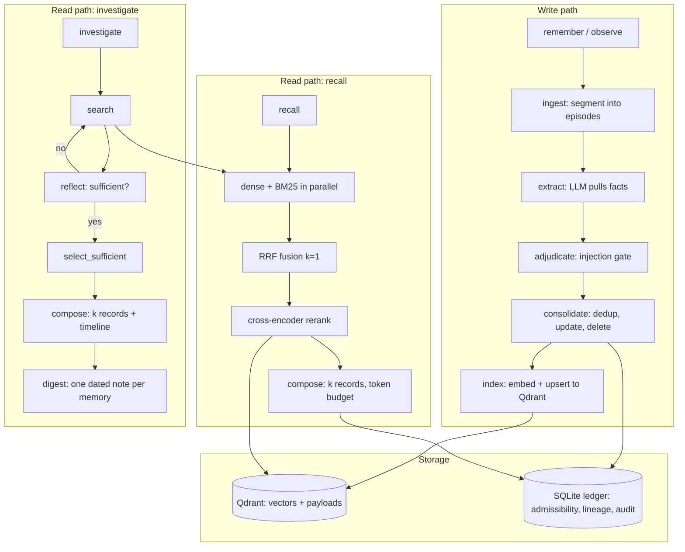
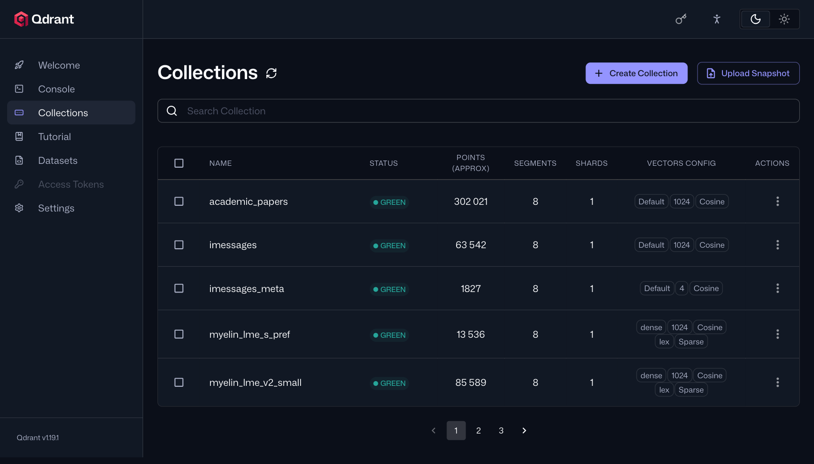
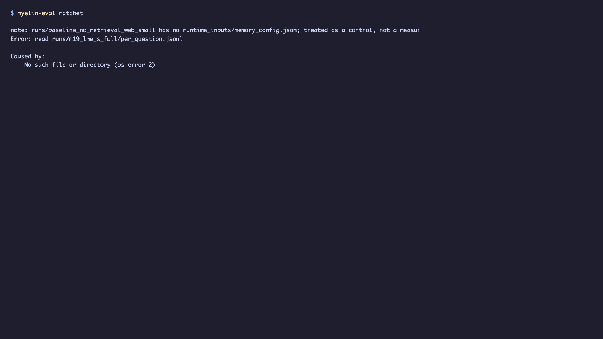

# myelin

Agentic long-term memory for LLM agents, backed by Qdrant. myelin gives an
agent a persistent, multi-tenant memory store with hybrid retrieval (dense +
BM25 + graph), cross-encoder reranking, and an agentic search→reflect loop —
all exposed through a 10-tool MCP surface.

**What it is:** a memory backend that an MCP-compatible agent (Claude, Codex,
any MCP client) can call to `remember` facts, `recall` them, and `investigate`
questions with an agentic loop. It is not a chatbot, not a vector database, and
not a RAG framework — it is the memory layer between an agent and its past.

**Why it exists:** agents that converse over long horizons need to persist what
they learned, retrieve it efficiently, and forget what is wrong. myelin
implements the full write path (extract → consolidate → adjudicate → index)
and two read paths (fast `recall`, agentic `investigate`) described in
[`PLAN.md`](PLAN.md).

## Quickstart

See [`docs/QUICKSTART.md`](docs/QUICKSTART.md) for a step-by-step guide with
every command executed and verified. Summary:

1. Build the workspace: `cargo build --release --workspace`
2. Start three services: Qdrant, an embedder, and a reranker
3. Point myelin at them with `MYELIN_*` env vars
4. Start the MCP server: `myelin-mcp --serve 127.0.0.1:7446 --collection <name> --ledger <path>`
5. Call `remember`, then `recall`

## Features

See [`docs/FEATURES.md`](docs/FEATURES.md) for the full feature reference:
- All 10 MCP tools with parameters, return shapes, and real examples
- Retrieval architecture (three channels, RRF, cross-encoder rerank, compose)
- Write path (dedup, consolidation, injection adjudication, quarantine)
- Multi-tenancy and the scope-before-ranking invariant
- Configuration: every `MYELIN_*` env var with its default
- The `myelin-eval` harness surface

## Architecture


```mermaid
graph TB
    subgraph "Write path"
        W1[remember / observe] --> W2[ingest: segment into episodes]
        W2 --> W3[extract: LLM pulls facts]
        W3 --> W4[adjudicate: injection gate]
        W4 --> W5[consolidate: dedup, update, delete]
        W5 --> W6[index: embed + upsert to Qdrant]
    end

    subgraph "Read path: recall"
        R1[recall] --> R2[dense + BM25 in parallel]
        R2 --> R3[RRF fusion k=1]
        R3 --> R4[cross-encoder rerank]
        R4 --> R5[compose: k records, token budget]
    end

    subgraph "Read path: investigate"
        I1[investigate] --> I2[search]
        I2 --> I3[reflect: sufficient?]
        I3 -->|no| I2
        I3 -->|yes| I4[select_sufficient]
        I4 --> I5[compose: k records + timeline]
        I5 --> I6[digest: one dated note per memory]
    end

    subgraph "Storage"
        Q[(Qdrant: vectors + payloads)]
        S[(SQLite ledger: admissibility, lineage, audit)]
    end

    W6 --> Q
    W5 --> S
    R5 --> S
    R4 --> Q
    I2 --> R2
```


*Figure 1: Qdrant web dashboard at `http://192.168.1.110:6333/dashboard` showing the real `myelin_locomo`, `myelin_longmemeval_s`, and `myelin_lme_v2_small` collections with their vector counts.*

## Configuration

Configuration layers: serialized defaults → `~/.myelin/config.yml` →
`MYELIN_`-prefixed environment variables, with `__` marking nesting
(`MYELIN_QDRANT__URL`, `MYELIN_QDRANT__COLLECTION`).

See [`docs/FEATURES.md`](docs/FEATURES.md#configuration) for the full env-var
table with defaults read from the code.

> **Note:** the hardcoded defaults point at the author's LAN
> (`192.168.1.110`). You will need to override them for your environment. See
> the quickstart for the generic forms.

## Building & testing

Three-crate workspace: `myelin-core` (backend library), `myelin-mcp` (MCP
surface), `myelin-eval` (evaluation harness). Build plan in
[`PLAN.md`](PLAN.md).

```
cargo build --release --workspace                    # build all three crates
cargo test --workspace                               # hermetic, no network
cargo test -p myelin-core --features integration     # requires Qdrant on big
MYELIN_QDRANT__URL=http://192.168.1.110:6334 cargo test -p myelin-core --features integration
```

The `integration` feature enables `crates/myelin-core/tests/qdrant_capability.rs`,
which asserts the four Qdrant 1.19.1 findings the storage design rests on —
three retrieval channels in one collection, server-side RRF at **k = 1** (not
Cormack's 60), gRPC-only multivector rerank, and the BM25 IDF scoring identity.
Measured in
[`docs/research/00-verified-environment.md`](docs/research/00-verified-environment.md)
§3. Each test creates and deletes its own `myelin_test_<fn>_<uuid>` scratch
collection and never touches an existing one; a failing assertion leaves its
scratch collection behind for inspection.

Release binaries are built to the shared target directory:

```
~/.cargo-target-shared/global/release/myelin-mcp
~/.cargo-target-shared/global/release/myelin-eval
```

## Evaluation

The `myelin-eval` harness is a **research tool**, not a product surface. It
scores myelin against the LoCoMo and LongMemEval-S benchmarks with deterministic
scorers and an LLM judge. See [`docs/EVALUATION.md`](docs/EVALUATION.md) and
[`docs/FEATURES.md`](docs/FEATURES.md#myelin-eval-harness) for the subcommand
surface.

Current standing against published systems (regenerated by `myelin-eval
standing`; the full table with comparability verdicts is
[`runs/standing/standing.md`](runs/standing/standing.md), the history is
[`BACKLOG_DONE.md`](BACKLOG_DONE.md#sota-standing)):

| gate | ours | best comparable | gap | since |
|---|---|---|---|---|
| `minja.asr.k6_prepopulated_defended` | **7.50%** | ≤10% | **CLOSED** | M15 |
| `locomo.judge_score_simplemem.n1540` | **78.64** | **84.41 LeanMem (Qwen3-8B)**, same judge | **−5.77, OPEN** † | bar moved 2026-09-30 |
| `locomo.judge_score_matched.n1540` (former gate) | 78.64 | 77.85 MemPro-15 (Qwen), same judge | +0.79 § | M84 |
| `longmemeval_s.judge_score_matched.n500` | **81.53** ◊ | 80.80 MemPro-15 (Qwen), LongMemEval's own judge | **+0.73, CLOSED** | round 5 + NLI premise |
| `locomo.judge_score.n1540` (strict 9B judge) | 70.84 | 77.85 MemPro-15 (Qwen) | −7.01 ‡ | M84 |
| `longmemeval_s.judge_score.n500` (strict 9B judge) | 81.20 ◊ | 80.80 MemPro-15 (Qwen) | +0.40 ‡ | round 5 + NLI premise |
| `lme_v2_small.overall_full_set.combined` | **78.05** | 74.90 AgentRunbook-C (frontier controller) | **+3.15** ¶ | M54 |

Every literature row is judged by a frontier API where we are judged by a
local Qwen3.5-9B (`caveat-judge`).

**Every number above is provisional (2026-09-30).** Moving myelin to its own
Qdrant showed that retrieval depended on Qdrant's arbitrary order among tied
scores. Ties are now broken by id, and both benchmarks are being re-measured
on that code. `standing` marks the old runs `stale-config` until then.

† **The LoCoMo bar moved (2026-09-30).**
[LeanMem](docs/research/sota-catalog-2026-09-30.md) (arXiv 2608.03463)
runs Qwen3-8B, an open model a third our reader's size, and reports **84.41**
on the 1,540 standard questions under SimpleMem's judge (GPT-4.1-mini).
- We re-graded our shipped answers with that judge: SimpleMem's own prompt
  verbatim, the same model and the same settings. We score **78.64**, 5.77
  behind.
- LeanMem's printed prompt and code are unpublished supplementary material,
  and its number is a 5-run mean. The user adopted it as the bar anyway, so
  LoCoMo is open again.
- LeanMem's method is typed memory. Each topic segment is stored as a profile,
  an event or a verbatim record, and a planner picks the types and budgets per
  question. That is the next LoCoMo round's reading list.

**A stronger same-class row, found after the gates closed (2026-09-29):**
[Hindsight](docs/research/sota-catalog-2026-09-29.md) (arXiv 2512.12818,
December 2025) runs gpt-oss-20b, an open 20B model, and reports **83.6 on
LongMemEval_S**. That is 2.1 points above our 81.53. Its judge is
GPT-OSS-120B with LongMemEval's own per-type prompts: the official prompts,
graded by a different model.
- Per question type, it leads us on single-session-user (−4.0 questions),
  preference (−4.3), multi-session (−2.3) and single-session-assistant
  (−2.0).
- We lead on temporal (+2.0) and knowledge-update (+0.3).
- It also reports 83.18 on LoCoMo, under a judge whose LoCoMo prompt it does
  not give.
- Both rows are in the registry, so `standing` tracks them.

**Then we checked how that 83.6 was produced, and it is not the same task.**
- LongMemEval_S names exactly its evidence sessions `answer_*`.
- Hindsight's paper-era runner stores each session under that id, and hands
  the whole recall result, ids included, to the answer model.
- In the paper's own released run, every question shows the answer model
  about 69 memories. About a third of them carry the `answer_` label, among
  unlabelled distractors.
- myelin's reader never sees a session id.
- So `standing` marks that row `not-comparable`, and MemPro-15 on
  Qwen3-30B (80.80) stays the strongest clean same-class row we know
  (`docs/research/sota-catalog-2026-09-29.md`, "The evidence-label
  leak").
§ **LoCoMo, graded the way the row we chase was graded
([M68](docs/measurements/m68-matched-judge.md)):** MemPro's 77.85 came from
gpt-4o-mini with LightMem's lenient prompt. The same grader, byte for byte,
gave our answers **78.18**. MemPro's own repo judge gave 80.26. The gate
takes the lower reading (the every-reading rule), so it is a `comparable` row
and a closed gate. **[M84](docs/measurements/m84-non-recall.md) (2026-09-29)
widened the lead to 78.64 (+0.79).** The reader had been answering "I don't
know." to open-domain questions like "Would Melanie go on another roadtrip
soon?", because its recall rule says to decline when the memories hold no
answer. A declined question of that shape is now asked again without the
rule. On those 43 questions it scores +16.3 [+7.0, +27.9] under LightMem's
grader and +11.6 strict, with no adversarial question touched. MemPro's own
judge now reads 80.78. The strict 9B judge (70.84) stays the headline and
still decides every arm. Under both graders we still trail MemPro on
multi-hop and open-domain. The LME-V2 row is measured at today's
shipped point (undated, digest on, rebuilt store); [M52](docs/measurements/m52-lme-v2-reader-thinks.md)
showed thinking does not close that gap and [M53](docs/measurements/m53-state-completion.md)
located it in retrieval. LoCoMo has resisted two arms: the LongMemEval_S
settings ([M51](docs/measurements/m51-locomo-at-the-shipped-point.md), −4.81) and the events calendar
([M50b](docs/measurements/m50b-locomo-events.md), −0.13, events crowding turns out of k = 6).
[M55](docs/measurements/m55-bonsai-27b-model.md) swapped in Bonsai 27B: LongMemEval_S rose
to 82.20, but the abstention veto fired, and LoCoMo fell 3.18 as the model declined twice as often.
**[M57](docs/measurements/m57-decline-first.md) fixed the veto with one reader clause.**
When a question assumes something the memories don't support, the reader says
"I don't know." first and gives the correction after. LongMemEval_S reached **79.20**:
+4.20 [+1.20, +7.40] over the 9B, with abstention at 29/30. It ships for LongMemEval_S.
‡ **Correction (2026-09-25).** We first reported 83.40 and said it passed MemPro-15
(80.80). A judge defect had counted seeded "correct" verdicts on answers M57 had
replaced with "I don't know."
([defect record](docs/measurements/defect-2026-09-25-stale-verdicts.md)). The
corrected 79.20 is 1.60 **behind** that row. LongMemEval's own grader agrees: 78.60
([M70](docs/measurements/m70-lme-official-judge.md)). The gate is open.
**Second correction (2026-09-28): 79.20 → 79.00.** The strict judge graded the 30
preference questions as facts, although their reference is a rubric ("The user would
prefer responses that …"). They now get LongMemEval's own preference criterion
([judge-preference-rubric](docs/measurements/judge-preference-rubric.md)). Under it the
strict judge is harsher on this stratum, and one of M57's preference answers no longer
counts.
◊ **LongMemEval_S closes its gate
([round-5 bundle](docs/measurements/r5-bundle-seeds.md), 2026-09-29).** Four
mechanisms ship together:
- dated events ([M73b](docs/measurements/m73b-dated-events.md));
- deeper retrieval for counting questions ([M72b](docs/measurements/m72b-aggregation-depth-uncapped.md));
- a preference clause for advice requests ([M77c](docs/measurements/m77-advice-profile-clause.md));
- a grounded second look at declines ([M71b](docs/measurements/m71b-grounded-every-named.md)).

Measured as the user chose: only the 183 rows a mechanism can change were
rerun, at three reader seeds each, against a base measured the same way. The
numbers are seed means:
- **81.13 under LongMemEval's own grader**, +3.3 [+1.7, +5.0], winning 31
  questions and losing 11;
- **80.80 under our strict judge**, +2.5 [+1.0, +4.2].

Abstention holds. The matched gate against MemPro-15 on Qwen3-30B (80.80)
is closed, by a small margin. The biggest single move is preference:
official +16.7 on its 30 questions. That came from one clause shown only to
advice requests, after two structured-answer designs failed
([M78](docs/measurements/m78-advice-answer-structure.md), [M78b](docs/measurements/m78b-advice-picks.md)).
`standing` quotes a seed mean ahead of any single lucky seed; the best
single seed read 81.6.

**Then an NLI model checks the premise (2026-09-29, the user's call).**
After the grounded pass, a declined question gets a typed second look:
- the reader writes the question and its answer as one statement;
- an NLI cross-encoder (DeBERTa-v3-large) must entail it from the memories
  the answer cites
  ([M82](docs/measurements/m82-nli-premise.md));
- on dialogue, the same claim about the other speaker must *not* be
  entailed ([M83](docs/measurements/m83-speaker-contrast.md));
- the statement must assert the question, not dispute it
  ([M83b](docs/measurements/m83b-assert-statement.md)).

It never answered an unanswerable trap. On LoCoMo's held-out runs it
flipped 0 adversarial questions, where the NLI model alone flipped up to 17.
The seed means rise to **81.53 official / 81.20 strict**. The gain is two
questions per seed, and M82's own stratum CI touched 0, so it shipped on the
user's decision rather than on the pre-registered rule.

¶ **LME-V2 ([M54](docs/measurements/m54-local-file-controller.md), 2026-09-27).** The benchmark
authors' own file-reading agent, AgentRunbook-C, now answers LME-V2 for myelin. It runs locally,
driven by Bonsai 27B instead of a frontier model. Over all 451 questions it scores **78.05**,
against 38.80 for myelin's own memory (+39.25 [+34.15, +44.12]), and 3.15 above the published
AgentRunbook-C row. That lead is `caveat-judge`: our reader and judge are the local 9B. The cost
is time: building each question's memory takes 5.6 minutes on web and 9.2 on enterprise, against
1–2 before. A native version over myelin's own ledger (M62) remains open.
Two gates close on `comparable` rows: MINJA's attack rate and LongMemEval_S
(+0.73). LoCoMo closed against MemPro-15 (M68; +0.79 since M84) and reopened
on 2026-09-30, when LeanMem's 84.41 became its bar (−5.77).


*Figure 2: `myelin-eval standing` output — 30 rows comparing myelin against published systems (MemPro, Mem0, Zep, NEMORI, etc.) with per-row comparability verdicts.*



*Figure 3: `myelin-eval ratchet` output — regression check against our own pinned floor. All 8 metrics held, 0 regressed.*

```
myelin-eval standing    # 30 rows, comparability verdicts per row
myelin-eval ratchet     # regression check against our own pinned floor
```

## Research vocabulary

The field's vocabulary — memory types, retrieval operations, context
engineering terms, and the 63-paper corpus survey — has been moved to
[`docs/research/00-vocabulary.md`](docs/research/00-vocabulary.md). It is
valuable for understanding the design space; it is not a front page.

## License

See [`LICENSE`](LICENSE).

## Documentation index

| Document | Contents |
|----------|----------|
| [Quickstart](docs/QUICKSTART.md) | Prerequisites, service setup, first remember/recall, MCP client config |
| [Features](docs/FEATURES.md) | All 10 MCP tools, retrieval architecture, write path, config table |
| [Documentation rubric](docs/DOCUMENTATION-RUBRIC.md) | Scored checklist from the documentation-quality literature |
| [Evaluation](docs/EVALUATION.md) | Benchmark methodology and results |
| [Research notes](docs/research/) | Vocabulary, systems survey, SOTA analysis |
| [Build plan](PLAN.md) | Milestone-by-milestone design document |